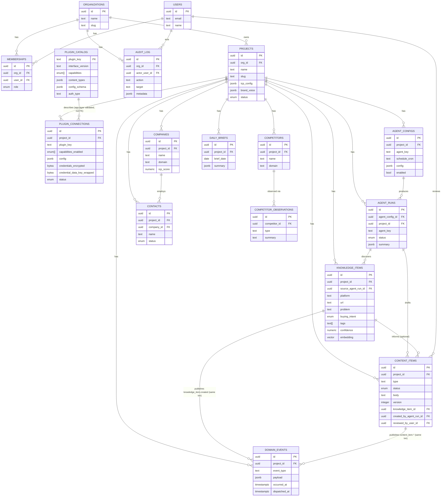

# Entity Relationship Diagram

Mirrors [`database/schema.sql`](../../database/schema.sql) exactly. If this diagram and the
DDL ever disagree, the DDL wins — update this file.

**Version 2** — adds `plugin_catalog`, `domain_events`, and `audit_log`; `content_items.type`
is now `text` (not a native enum, so it's not shown as `enum` below); `plugin_connections`
gains `config` and the envelope-encryption columns; `content_items` gains `version`.

**OAuth2 framework** (ADR 0011, `docs/auth/OAUTH2_ARCHITECTURE.md`) — `plugin_connections`
gains `label` (multiple connections per plugin per project), `token_expires_at` and
`granted_scopes` (plaintext), and `plugin_connection_status` gains the `expired` value.
Relationships below are unchanged — this is additive columns on an existing entity, not a new
one.

## Reading this diagram

- Every box except `ORGANIZATIONS`, `USERS`, `MEMBERSHIPS`, `PLUGIN_CATALOG`, and
  `AUDIT_LOG` (org-scoped, not project-scoped) either directly or transitively hangs off
  `PROJECTS` — this is the tenant/project scoping described in `ARCHITECTURE.md` §2 and
  `docs/database/SCHEMA.md`. `PLUGIN_CATALOG` is deliberately global (not project- or
  org-scoped at all) — it describes what plugins are *installed on this deployment*, not
  anything project-specific; `PLUGIN_CONNECTIONS` is where the project-specific data lives.
- `PLUGIN_CATALOG → PLUGIN_CONNECTIONS` is explicitly **not** a foreign key — see
  `docs/database/SCHEMA.md`'s `plugin_catalog` note for why (the catalog is rebuilt at every
  process start; a hard FK would create ordering hazards during that rebuild).
- `KNOWLEDGE_ITEMS → DOMAIN_EVENTS` and `CONTENT_ITEMS → DOMAIN_EVENTS` represent the
  transactional-outbox relationship (`ARCHITECTURE.md` §7) — an event is written in the same
  transaction as the row it describes, which this diagram can't express as a constraint but
  is the single most important property of how these tables are used together.
- `KNOWLEDGE_ITEMS → CONTENT_ITEMS` is optional (a `content_item` can exist without a
  triggering `knowledge_item`) — the FK is nullable in the DDL.
- `AGENT_RUNS` is the audit spine: both `knowledge_items` and `content_items` trace back to
  the specific run that produced them, which is what makes "why did GrowthOS suggest this"
  answerable months later.
